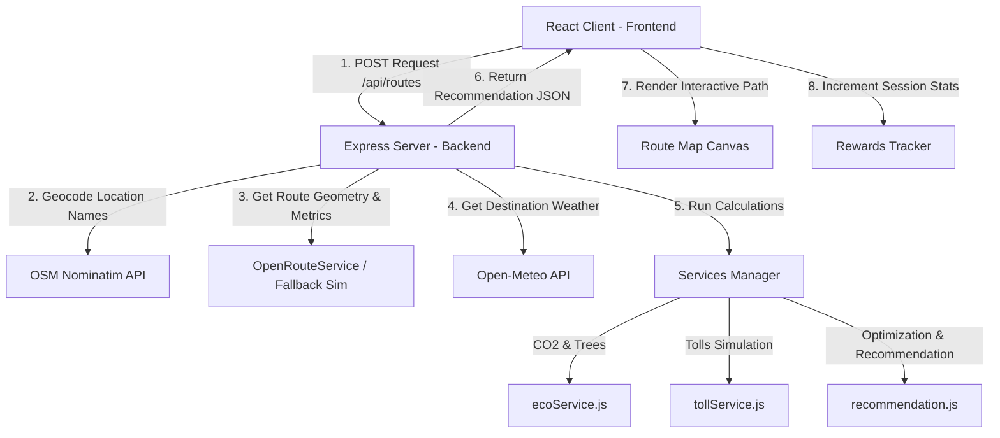

# EcoRoute Navigator

### Intelligent Eco-Friendly & Toll-Optimized Route Recommendation System

EcoRoute Navigator is a premium, fully interactive web dashboard that recommends optimal transit routes based on carbon emissions, highway toll pricing, and vehicle categories. It provides real-time estimations of environmental impacts, fuel expenditures, and potential savings to nudge commuters and logistics fleets toward sustainable decisions.

---

## Table of Contents
1. [Introduction](#1-introduction)
2. [Problem Statement](#2-problem-statement)
3. [Solution Overview](#3-solution-overview)
4. [Core Features](#4-core-features)
5. [Tech Stack](#5-tech-stack)
6. [Architecture Flow](#6-architecture-flow)
7. [Vehicle Specifications Ledger](#7-vehicle-specifications-ledger)
8. [Judge Evaluation Scenario](#8-judge-evaluation-scenario)
9. [Future Development Scope](#9-future-development-scope)
10. [Installation & Local Setup](#10-installation--local-setup)

---

## 1. Introduction
With urban congestion and climate concerns reaching an all-time high, everyday navigation requires more than just the fastest path. **EcoRoute Navigator** introduces a multi-criteria optimization recommendation engine that balances carbon emissions, travel duration, fuel economy, and highway toll budgets. 

> [!NOTE]
> The platform targets the critical intersection of green commuting and economic efficiency, aligning everyday vehicle travel with corporate ESG (Environmental, Social, and Governance) targets.

---

## 2. Problem Statement
Traditional navigation applications prioritize transit speed or physical distance. Commuters looking to minimize their carbon footprint or avoid expensive tolls must manually compare alternative routes. There is currently no automated recommendation system that combines:
* Tailored vehicle fuel efficiency parameters.
* Dynamic toll fee structures.
* Actionable carbon offset validation.
* Meteorological effects on battery output and safety.

---

## 3. Solution Overview
EcoRoute Navigator gathers route coordinates, geocodes input endpoints via Nominatim, evaluates vehicle types, and calculates a normalized **Eco Score (0-100)** for every path. 

The system highlights the optimal route based on the selected preference:
* **Eco Profile**: Selects the route representing the absolute minimum carbon emissions.
* **Least Toll Profile**: Selects the path minimizing direct highway toll costs.
* **No Toll Profile**: strictly filters out routes that charge highway tolls, selecting only free roads.
* **Balanced Profile**: Ranks routes by evaluating a multi-attribute formula (70% Carbon Score + 30% Toll Score).

---

## 4. Core Features

### Alternating Information Panels
* Alternating image-and-text layouts provide detailed insights into environmental impacts and dynamic weather adaptations.

### Stabilized GPS Odometer Tracking
* Features a real-time HUD console that ignores initial GPS drifts (during the first 3 seconds of tracking) to ensure that odometer distance measurements start exactly at 0 km.

### Interactive Dual-Engine Map Layers
* Detects browser WebGL capabilities. If Mapbox fails or is unauthorized, the map fallback layer automatically mounts a Leaflet canvas with minimal light CartoDB tiles to maintain theme integrity.

### Active Sustainability Rewards
* Includes an overlay panel displaying XP logs, points history, trees saved equivalences, and commute streaks.

---

## 5. Tech Stack

* **Frontend**: React.js (Vite Single Page Application), Tailwind CSS, Leaflet Maps (`react-leaflet`), Lucide Icons.
* **Backend**: Node.js, Express, Axios, Dotenv, CORS.
* **Services**:
  * **Open-Meteo API**: Free weather forecasts (no keys required).
  * **OpenStreetMap (Nominatim)**: Free geocoding service (no keys required).
  * **Mapbox GL JS**: Map rendering SDK (access token configurable in env files).

---

## 6. Architecture Flow



---

## 7. Vehicle Specifications Ledger

The system evaluates emission outputs and fuel costs using the following calibrated combustion parameters:

| Vehicle Category | Fuel Consumption Rate | CO₂ Emissions Factor |
| :--- | :--- | :--- |
| Petrol Car | 15 km/L | 0.12 kg/km |
| Diesel Car | 12 km/L | 0.14 kg/km |
| Motorbike | 35 km/L | 0.08 kg/km |
| EV (Electric) | 6 km/kWh | 0.03 kg/km (Grid Eq.) |

---

## 8. Judge Evaluation Scenario

For validation, the search panel includes a **Load Demo** trigger. Clicking it initializes the following path optimization:
* **Starting Point**: Noida Sector 62
* **Destination**: IGI Airport
* **Vehicle Type**: Petrol Car
* **Optimization**: Balanced

The engine calculates and compares three paths:

| Route Option | Distance | Time | Toll Fee | CO₂ Output | Eco Score | Recommendation |
| :--- | :--- | :--- | :--- | :--- | :--- | :--- |
| **Route A (via NH-24)** | 31 km | 40 mins | ₹120 | 3.7 kg | 72 | Alternative |
| **Route B (via Ghazipur)** | 35 km | 45 mins | ₹0 | 4.2 kg | 68 | Alternative |
| **Route C (via DND Flyway)** | 38 km | 35 mins | ₹60 | 3.4 kg | 85 | **Recommended** |

> [!TIP]
> Route C represents the optimal balance, saving **0.8 kg of CO₂** and **₹60 in toll fees** compared to maximum emitting alternatives.

---

## 9. Future Development Scope
* **Ambient Pricing Feed**: Dynamic fuel price updates based on state-level rates in India.
* **EV Charger Reservation**: Integration with public DC charger APIs to check live socket availability and reserve slots.
* **Corporate ESG Export**: Automated PDF reports compiling accumulated carbon credits for corporate sustainability audits.

---

## 10. Installation & Local Setup

### Prerequisites
* [Node.js](https://nodejs.org/) (v18 or higher)
* NPM

### Setup Backend
1. Open a terminal in the `backend/` directory.
2. Install dependencies:
   ```bash
   npm install
   ```
3. Run the development server:
   ```bash
   npm run dev
   ```
   The server starts at `http://127.0.0.1:5000`.

### Setup Frontend
1. Open a terminal in the `frontend/` directory.
2. Install dependencies:
   ```bash
   npm install
   ```
3. Create a local environment file `.env.local` inside the `frontend/` folder:
   ```text
   VITE_MAPBOX_TOKEN=your_mapbox_token
   VITE_API_URL=http://127.0.0.1:5000
   ```
4. Run the client dev server:
   ```bash
   npm run dev
   ```
   The client starts at `http://localhost:5173`. Open it in your browser and click **Load Demo** to test.
