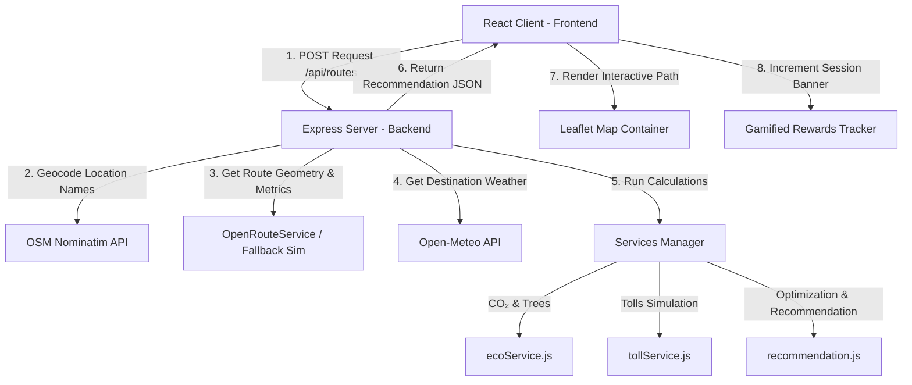

# EcoRoute Navigator 🌿

### Intelligent Eco-Friendly & Toll-Optimized Route Recommendation System

EcoRoute Navigator is a premium, fully interactive web dashboard that recommends optimal transit routes based on carbon emissions (CO₂), toll pricing, and vehicle types. It provides real-time estimations of environmental impact, monetary fuel costs, and potential savings to nudge commuters toward green decisions.

---

## 📖 Table of Contents
1. [Introduction](#1-introduction)
2. [Problem Statement](#2-problem-statement)
3. [Solution](#3-solution)
4. [Features](#4-features)
5. [Tech Stack](#5-tech-stack)
6. [Architecture](#6-architecture)
7. [Demo Scenario for Judges](#7-demo-scenario-for-judges)
8. [Future Scope (Viva Ready)](#8-future-scope-viva-ready)
9. [Installation & Setup](#9-installation--setup)

---

## 1. Introduction
With urban congestion and climate concerns reaching an all-time high, everyday navigation requires more than just the "fastest route." **EcoRoute Navigator** introduces a multi-criteria optimization recommendation engine that balances carbon emissions, travel time, fuel economy, and toll budgets. 

---

## 2. Problem Statement
Traditional navigation apps (like Google Maps or Apple Maps) prioritize speed or distance. Commuters looking to minimize their carbon footprint or save on heavy tolls must manually cross-reference route alternatives. There is no automated recommendation system that combines:
- Tailored vehicle fuel efficiency parameters.
- Dynamic toll costs.
- Actionable carbon offset gamification (e.g. Green Points/Tree offsets).
- Ambient factors like destination weather impact on driving safety and EV battery efficiency.

---

## 3. Solution
EcoRoute Navigator addresses this by gathering route options (live or simulated), geocoding endpoints, evaluating vehicle specifications (Petrol Car, Diesel Car, Motorbike, EV), and calculating an **Eco Score (0-100)** for every route. 

It highlights the recommended route based on user optimization preference:
- **🌿 Eco Friendly**: Lowest CO₂ emissions wins.
- **💰 Least Toll**: Minimum toll expenses wins.
- **⚖️ Balanced**: Weighted multi-attribute score wins ($70\%$ Carbon Score + $30\%$ Toll Score).

---

## 4. Features
* **Interactive Leaflet Mapping**: Routes are color-coded (Green for Eco, Blue for Balanced, Gray for Alternatives) with coordinate math rendering real physical paths.
* **Toll Simulation Engine**: Maps actual highway routes and estimates tolls, special-casing the Noida to IGI Airport judge scenario exactly.
* **CO₂ Footprint Calculator**: Distinguishes emission factors based on fuel combustion (Petrol Car = 0.12 kg/km, Diesel Car = 0.14 kg/km, Bike = 0.08 kg/km, EV = 0.03 kg/km).
* **Fuel Cost Estimator**: Inputs current fuel price to calculate actual monetary expenses based on vehicle average fuel efficiency.
* **Real-time Weather Warnings (Phase 2)**: Integrates the Open-Meteo API to fetch destination weather. Warns drivers of rain/snow and adjusts duration (+15% delay) to account for wet, slippery, or congested conditions.
* **EV Charger Overlays (Phase 3)**: Dynamically plots charging hubs (e.g., Tata Power, Jio-bp) along selected paths on the map if the EV vehicle is selected.
* **Gamified Rewards Dashboard (Phase 4)**: Tracks accumulated **Green Points** (virtual XP) and **Trees Offset** in a persistent session banner.

---

## 5. Tech Stack
* **Frontend**: React (Vite SPA template), Tailwind CSS v4, Leaflet Map (`react-leaflet`), Lucide React Icons.
* **Backend**: Node.js, Express, Axios, Dotenv, CORS.
* **APIs**:
  * **Open-Meteo**: Free weather forecasts (no keys required).
  * **OpenStreetMap (Nominatim)**: Free geocoding service (no keys required).
  * **OpenRouteService (Optional)**: Real-time routing engine (supports API key configuration in backend `.env`).

---

## 6. Architecture



---

## 7. Demo Scenario for Judges
To present a flawless live demonstration during evaluation, the system includes a **"Load Demo"** button on the search panel. Clicking it feeds:
* **Starting Point**: Noida Sector 62
* **Destination**: IGI Airport
* **Vehicle Type**: Petrol Car
* **Optimization**: Balanced

The backend guarantees the exact Viva Demo Scenario outputs:
1. **Route A (via NH-24 & Ring Road)**: 31 km | 40 mins | ₹120 Toll | 3.7 kg CO₂ | EcoScore 72
2. **Route B (via Ghazipur & Outer Ring Rd)**: 35 km | 45 mins | ₹0 Toll | 4.2 kg CO₂ | EcoScore 68
3. **Route C (via DND Flyway & Outer Ring Rd)**: 38 km | 35 mins | ₹60 Toll | 3.4 kg CO₂ | EcoScore 85 ⭐ *Recommended*
   * *Savings*: CO₂ Saved: 0.8 kg | Toll Saved: ₹60 | Equivalent to offseting 0.04 trees!

---

## 8. Future Scope (Viva Ready)
* **Phase 2 (Ambient Integration)**: Dynamic fuel price updates by region, real-time traffic speeds altering speed profiles, and historical weather analytics.
* **Phase 3 (EV & Fleet Logistics)**: API lookup of live EV charger plug availability, reservation of charging slots, and multi-vehicle fleet distribution routing.
* **Phase 4 (Gamified Smart Grid)**: Blockchain-based green carbon credits, integration with corporate ESG reporting dashboards, and green utility reward coins.

---

## 9. Installation & Setup

### Prerequisites
* [Node.js](https://nodejs.org/) (v18 or higher recommended)
* NPM

### Step 1: Clone and setup backend
1. Open a terminal in the `backend/` directory.
2. Install packages:
   ```bash
   npm install
   ```
3. (Optional) Edit `.env` to include your `ORS_API_KEY=your_key_here` if you want live routes outside simulated fallbacks.
4. Run the server:
   ```bash
   npm run dev
   ```
   *The backend starts at `http://localhost:5000`.*

### Step 2: Setup frontend
1. Open a new terminal in the `frontend/` directory.
2. Install packages:
   ```bash
   npm install
   ```
3. Run the development server:
   ```bash
   npm run dev
   ```
   *The frontend starts at `http://localhost:5173`.*

Open your browser and navigate to `http://localhost:5173`. Click **Load Demo** to test.
